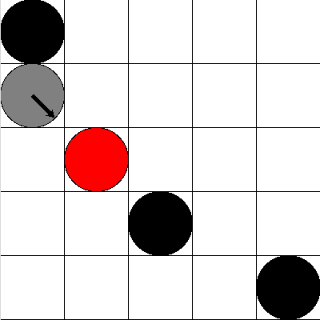

# rl2d

This code launches a Python Tkinter interface displaying a learning process of a **Q-learning** agent in a 2D grid-world. 

Two navigational tasks are available for learning, each with its own environment: 
* Learning to reach a point in an empty world; 
* Learning to reach a point in an obstacle scattered world.
___
## Run the simulation
To run with **default** parameters, enter in the terminal: `python run_rl2d.py`

___
## Parameters
#### Q-learning:
* `--learning_rate`, **default**=$0.1$. The learning rate $\alpha \in [0,1]$.
* `--discount_factor`, **default**=$0.99$. The discount factor $\gamma \in [0,1]$. In the extreme, for $\gamma=1$ we have a long-term view agent. For $\gamma=0$ we have a myopic agent.
* `--episodes`, **default**=4000. The number of learning episodes $e$.
* `--initial_epsilon`, **default**=1. The initial epsilon $\epsilon_i$ is the exploration probability in the beggining of the learning process. An $\epsilon = 1$ represents a totally random agent. An $\epsilon = 0$ represents a totally greedy agent.
* `--final_epsilon`, **default**=0.05. The value of the final exploration probability $\epsilon_f$.

#### Environment:
* `--env_type`, **default**='empty'. The type of the environment $e_t \in \{empty, obstacle\}$.
* `--env_dim`, **default**=5. The environment dimension $e_d \in [3,9]$.
* `--num_obstacles`, **default**=2. The number of obstacles $n_o \ge 0$ in the environment.

___
## Results
 After training, a timestamped folder `runs/run-<year>_<month>_<day>_<hour>_<minute>_<second>/` is created with results from the training and evaluation procedure:
* The trajectories per evaluation scene
* Metric plots
  * Average cummulative reward
  * Average steps
  * Ending causes (e.g., collision or goal reaching)